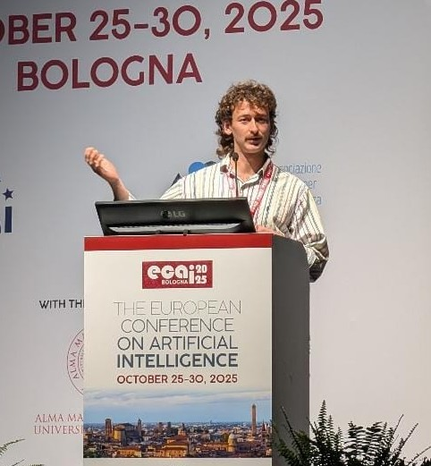

  

  

    <h1>Gwen Maudet</h1>

    

      Postdoctoral Researcher 
      <a href="https://www.uni.lu/snt-en/">University of Luxembourg</a> ·
      <a href="https://www.uni.lu/snt-en/research-groups/pcog/">SnT · PCOG</a>
    

    

      I'm a postdoctoral researcher in mathematical optimization, with
      interests in solver improvement, sometimes in heterogeneous contexts,
      and a particular emphasis on formulations of real-world networking
      and industrial problems.
    

    

      <a href="mailto:gwen.maudet@uni.lu">✉ Email</a>
      <a href="https://orcid.org/0000-0003-0340-2542">◉ ORCID</a>
      <a href="https://www.linkedin.com/in/gwen-maudet-1a1490171/">in LinkedIn</a>
      <a href="cv_gwen_maudet.pdf">↓ CV</a>
    

  

  
TL;DR

  

    I formulate mathematical models for networking and industrial
    problems, develop algorithms to solve them, and use machine
    learning to make optimization solvers faster and more effective.
  

  <section>
    <h2>Interests</h2>

    <ul class="interest-list">
      <li>Mixed-Integer Programming</li>
      <li>Machine Learning for Solvers</li>
      <li>Generalizability of Machine Learning for Optimization</li>
      <li>Optimization in Engineering</li>
      <li>Algorithm Design</li>
      <li>Mesh and Star Network Topologies</li>
    </ul>
  </section>

  <section>
    <h2>Education</h2>

    

      

        2020–2023
        

          <strong>PhD in Computer Science</strong>
          
IMT Atlantique · Rennes, France

        

      

      

        2016–2020
        

          <strong>Engineering Degree</strong>
          

            IMT Atlantique · Nantes, France 
            Computer Science for Decision Support
          

        

      

      

        2014–2016
        

          <strong>Classes Préparatoires</strong>
          

            Lycée Rabelais · MPSI → MP
          

        

      

    

  </section>

<section class="experience-section">

  

    <h2>Experience</h2>
    <a href="cv_gwen_maudet.pdf">Full CV →</a>
  

  

    <article class="experience-item current">
      

        Dec. 2023 — present
      

      

        <h3>Postdoctoral Researcher</h3>
        

          University of Luxembourg · Esch-sur-Alzette, Luxembourg
        

        

          <strong>Machine Learning for Mixed-Integer Linear Programming.</strong>
          Research on integrating learning techniques into key components
          of exact optimization solvers, with a focus on population-based
          methods and generalization across heterogeneous MILP instances.
        

        

          I also teach at the master's level, supervise student projects,
          and co-supervise a PhD student within the
          <a href="https://danoy.gforge.uni.lu/project/ultrabo/">
            Ultra Big Optimization
          </a>
          project.
        

      

    </article>

    <article class="experience-item">
      

        Apr. — Sep. 2020
      

      

        <h3>Research Intern</h3>
        

          Inria · Rennes, France
        

        

          <strong>Detecting Bias in Search Engines.</strong>
          Developed tools for detecting biases between search engines,
          including their integration into the
          <a href="https://snide.irisa.fr">SNIDE</a> platform.
        

      

    </article>

    <article class="experience-item">
      

        Jun. — Aug. 2019
      

      

        <h3>Research Intern</h3>
        

          Acklio · Rennes, France
        

        

          <strong>Header Compression for IoT Networks.</strong>
          Developed clustering-based methods to identify similarities
          between IoT transmission headers and automatically generate
          compression rules based on RFC 8724.
        

      

    </article>

  

</section>

  <a href="research/" class="navigation-card">
    <strong>Research</strong>
    Projects, publications and research topics →
  </a>

  <a href="teaching/" class="navigation-card">
    <strong>Teaching</strong>
    Courses, lectures and student supervision →
  </a>

  <a href="other/" class="navigation-card">
    <strong>Other activities</strong>
    Service, reviewing and other activities →
  </a>

