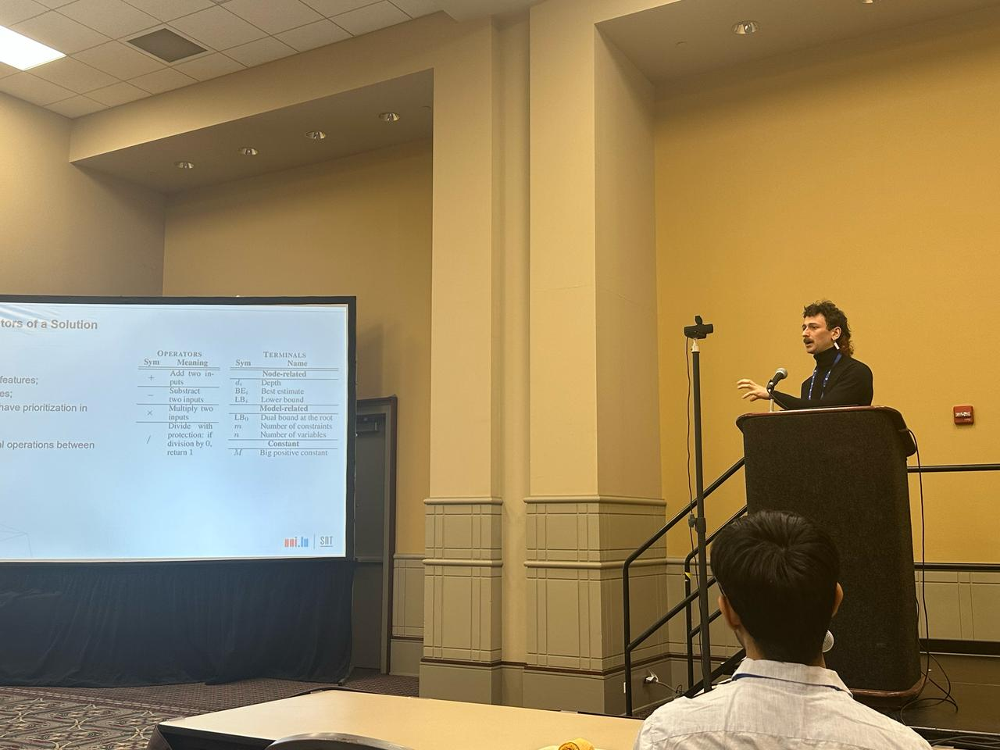

I am a postdoctoral researcher at the University of Luxembourg, SNT, [PCOG team](https://www.uni.lu/snt-en/research-groups/pcog/), specializing in the integration of machine learning techniques in mixed integer linear programming solvers. Previously, I did my PhD in IMT Atlantique Rennes (France), [SRCD department](https://www.imt-atlantique.fr/fr/l-ecole/departements-d-enseignement-recherche/srcd) where my research focused on theoretical frameworks for the Massive IoT paradigm.

This website offers a brief overview of my research and teaching activities. For a comprehensive and detailed presentation, please see my [extended academic CV (PDF)](cv_gwen_maudet.pdf).

---

## Contact
 
- **Phone:** +33(0)631430768  
- **Email:** [gwen.maudet@uni.lu](mailto:gwen.maudet@uni.lu)
- [orcid](https://orcid.org/0000-0003-0340-2542)  
- [LinkedIn](https://www.linkedin.com/in/gwen-maudet-1a1490171/)

 
---

## References

- **[Dr Grégoire Danoy](https://www.uni.lu/fstm-en/people/gregoire-danoy/)** — Research Scientist, PCOG, SnT, University of Luxembourg (Postdoc mentor)
- **[Prof. Patrick Maillé](https://www.imt-atlantique.fr/fr/personne/patrick-maille)** — Professor, SRCD, IRISA, IMT Atlantique, France (PhD supervisor)
- **[Prof. Laurent Toutain](https://www.imt-atlantique.fr/fr/personne/laurent-toutain)** — Professor, SRCD, IRISA, IMT Atlantique, France (PhD director)

---

- [Research](research/)
- [Teaching](teaching/)
- [Other Activities](other/)
